# Train Station API

---

# DB Structure

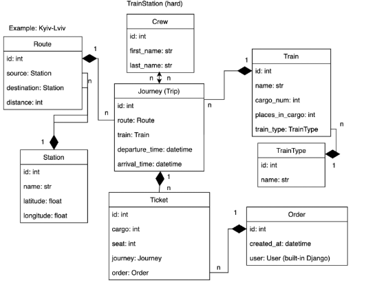

---

**API service for train station management built with DRF**

---

## Features

- JWT Authentication
- Admin Panel: `/admin/`
- Swagger Documentation: `/api/doc/swagger/`
- Manage:
  - Journeys, Trains, Routes, Stations
  - Crews, Train Types, Tickets, Orders
- Advanced Filtering for key resources
- RESTful endpoints with DRF best practices

---

## Installing using Github
```bash
# Clone the repository
git clone https://github.com/AndriiFn/train-station-api.git

# Navigate to the project directory
cd train-station-api

# Create a virtual environment
python3 -m venv venv

# Activate the virtual environment:

# On macOS/Linux:
source venv/bin/activate

# On Windows:
venv\Scripts\activate

# Install dependencies
pip install -r requirements.txt

# Configure environment variables

# Set the following environment variables manually, or create a ".env" file with the same content:

SET DB_HOST=<your_db_host>
SET DB_NAME=<your_db_name>
SET DB_USER=<your_db_user>
SET DB_PASSWORD=<your_db_password>
SET SECRET_KEY=<your_django_secret_key>


# Run the Django development server
python manage.py runserver

# Loading Data (optional)
To import data into your database, run this command:

python manage.py loaddata data.json
```

## Run with Docker
---
Docker should be installed 
```bash
docker-compose build
docker-compose up
```

## Getting access
* create user via /api/user/register/
* get access token via /api/user/token/

## Screenshots
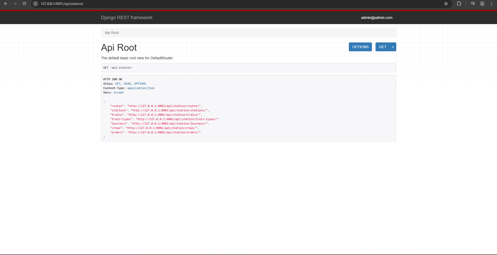
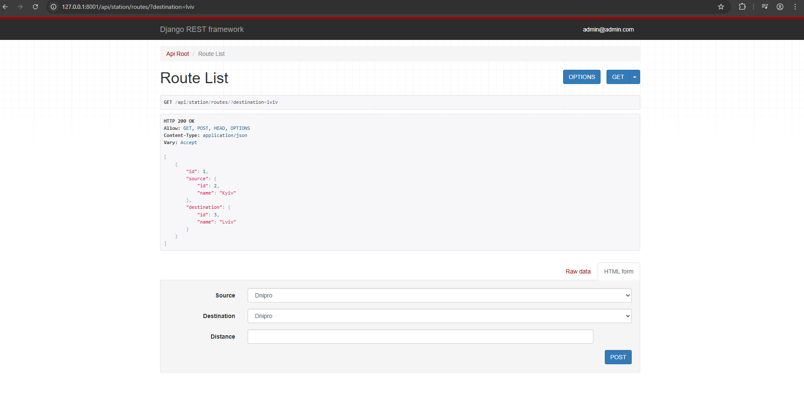
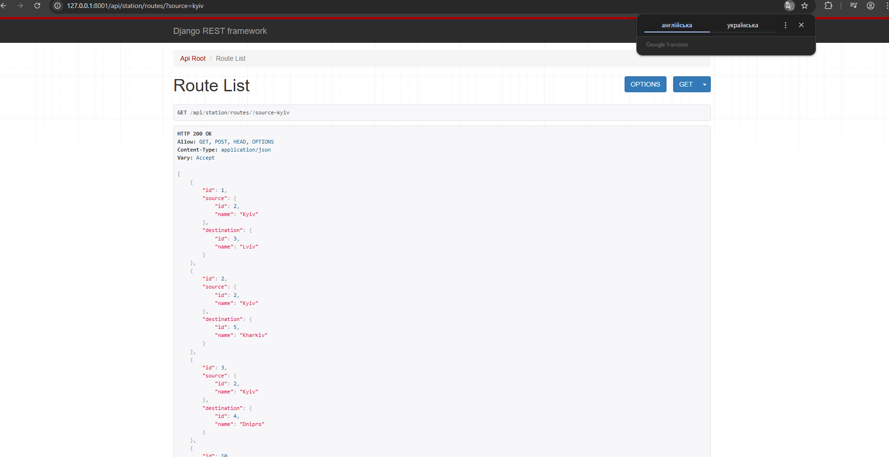
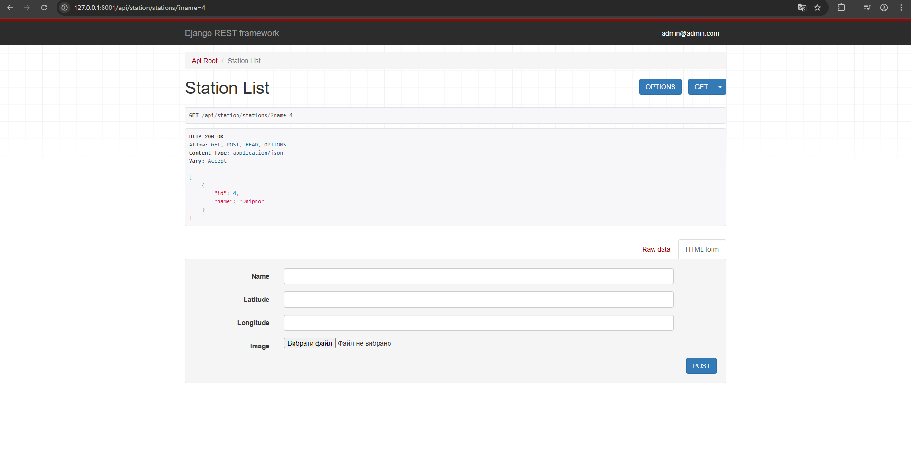
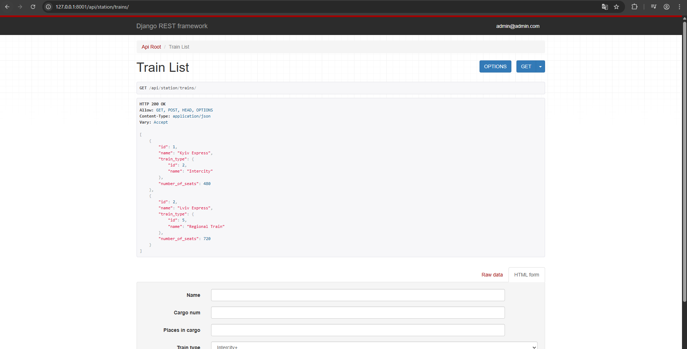
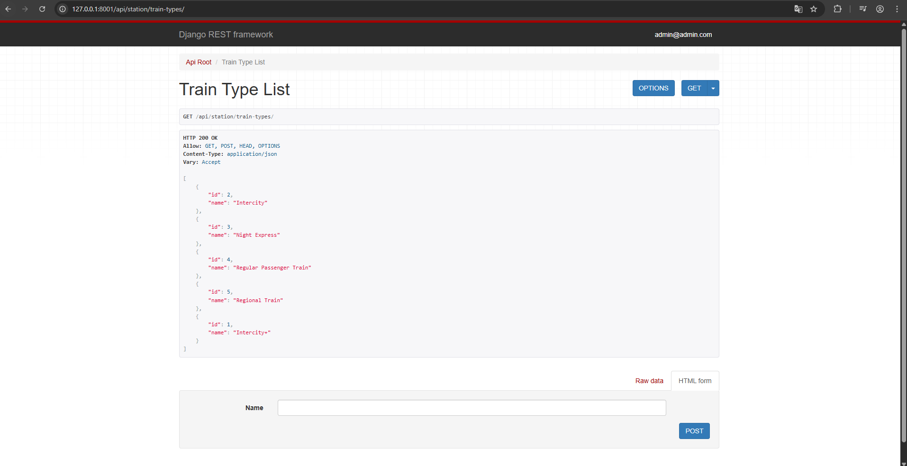
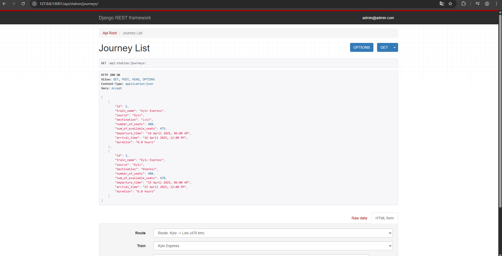
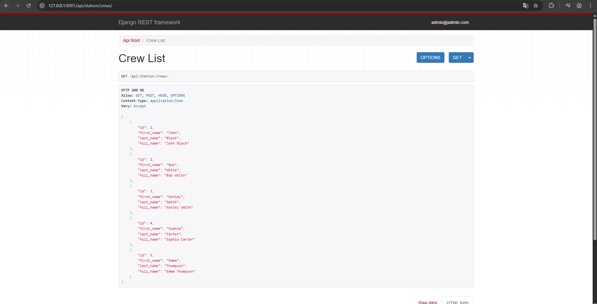
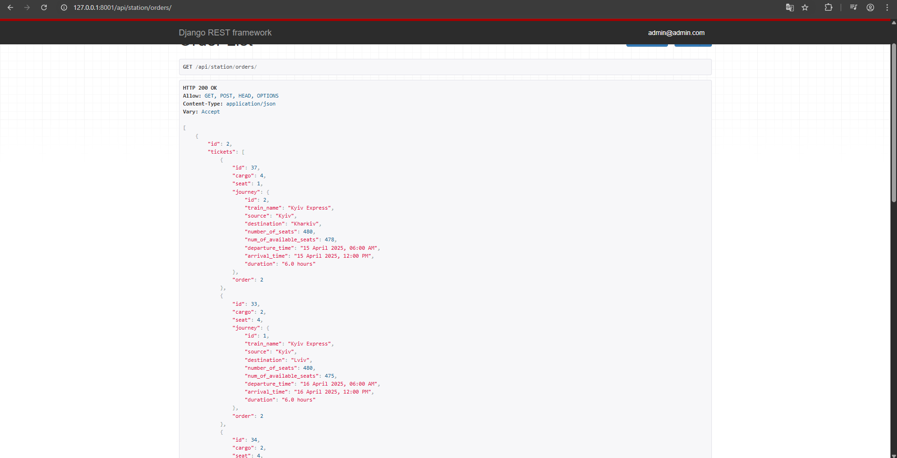
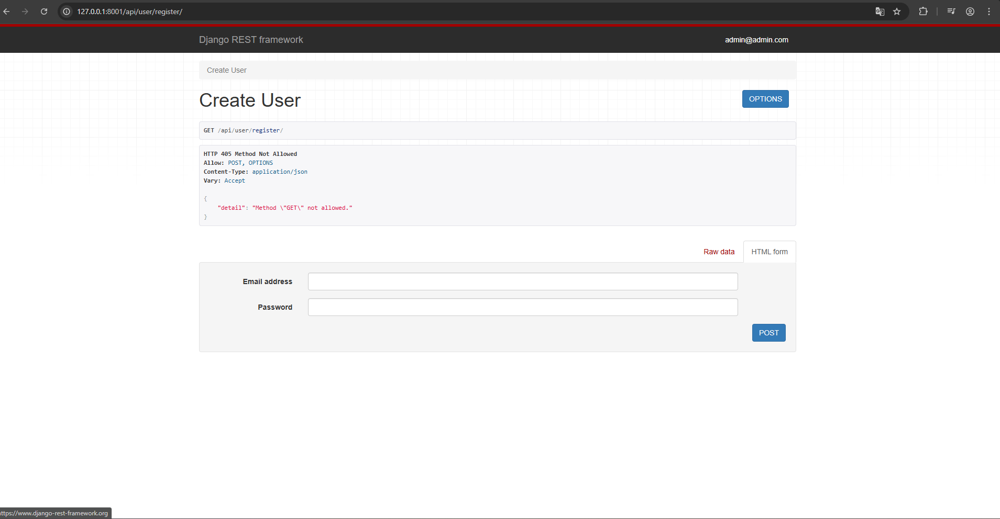

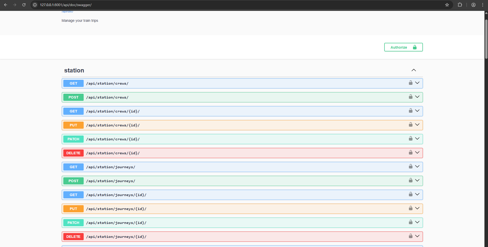
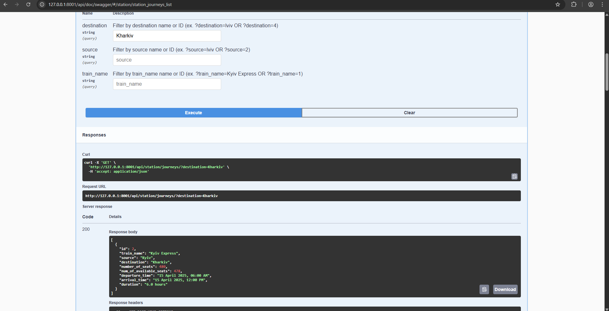
